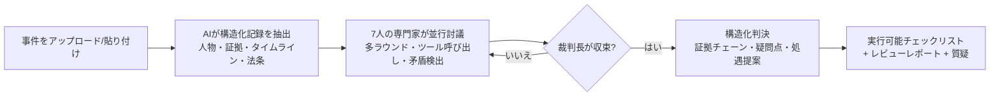
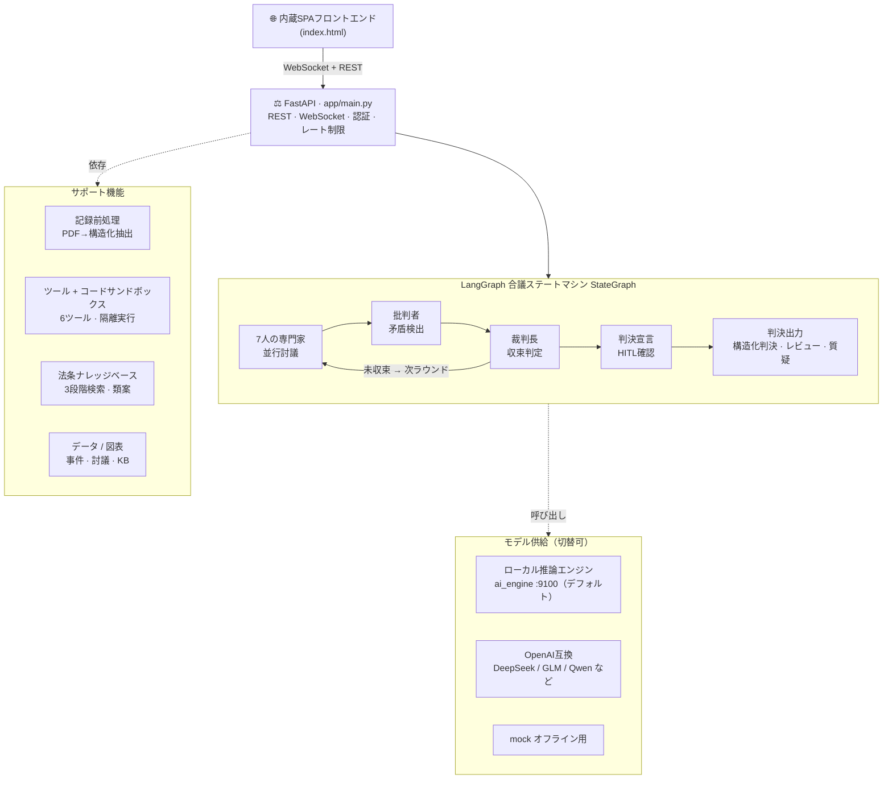

<p align="center">
  
</p>

<h1 align="center">⚖️ VerdictAI</h1>

<p align="center">
  <b>7人のAI専門家が実際の事件記録を反対尋問し、実際の法条と類案を引用。証拠チェーン付きの構造化判決をそのまま手渡します—APIキーは不要です。</b>
</p>

<p align="center">
  <a href="https://github.com/x33834/VerdictAI"></a>
  <a href="https://github.com/x33834/VerdictAI/releases/latest"></a>
  <a href="https://github.com/x33834/VerdictAI/actions"></a>
  <a href="https://img.shields.io/badge/Python-3.10%2B-3776AB?style=for-the-badge&logo=python&logoColor=white"></a>
  <a href="https://img.shields.io/badge/License-MIT-yellow?style=for-the-badge"></a>
</p>

<p align="center">
  <a href="https://x33834.github.io/VerdictAI/"></a>
  <a href="https://github.com/x33834/VerdictAI/releases/latest/download/VerdictAI.zip"></a>
  <a href="https://github.com/Morningstar202604/VerdictAI"></a>
  <a href="https://gitcode.com/badhope/VerdictAI"></a>
  <a href="https://gitee.com/badhope/VerdictAI"></a>
</p>

<p align="center"><b>公式サイト</b>（GitHub Pages 両アカウント、内容同一）：
  <a href="https://x33834.github.io/VerdictAI/">x33834.github.io/VerdictAI</a> ·
  <a href="https://morningstar202604.github.io/VerdictAI/">morningstar202604.github.io/VerdictAI</a>
</p>

<p align="center">
  <a href="README.zh-CN.md">中文</a> · <a href="README.md">English</a> · <strong>日本語</strong>
</p>

---

## 5分だけ時間をください

多くの法律AIデモは「1段落の回答」で終わります。VerdictAIは**本物の合議**を実行します:
事件PDFをドラッグ＆ドロップするだけで、組み込みの**ローカル推論エンジン**が読み取り、
人物・証拠・タイムライン・適用法条を抽出。**7人の専門エージェントが複数ラウンドにわたって
互いに反対尋問**し、批判者が矛盾を指摘、裁判長が判決へ収束。証拠チェーンと実行可能な
チェックリストが手に入ります。全工程がブラウザにリアルタイム配信されます。

> クラウドAPI不要・サインアップ不要・プレースホルダーなし: 組み込みのローカルエンジン
> （`ai_engine`、ポート9100）が手元の事件記録を実際に分析します。

| | 従来の AI Q&A | **VerdictAI** |
|---|---|---|
| 立場 | 単一モデル、一つの意見 | **7人の専門家が反対尋問し合い挑戦** |
| 産出 | 一回限りのテキスト | **多ラウンド合議 + 矛盾検出** |
| 信頼性 | ブラックボックス | **全イベントライブ配信** — トークン・ツール呼び出し・状態 |
| 引用 | 幻覚の恐れ | **実際の法条・類案**を検索（決して捏造しない） |
| 文書 | 非構造化アップロード | **AI記録理解** — 人物 / 証拠 / タイムライン / 法条を自動抽出 |
| 成果物 | 「AIが言った」 | **構造化判決** — 証拠チェーン・疑問点・次のアクション |

## こんな人に向いています

- **法律実務家** — 主張を確定する前に、証拠チェーンと適用法条の「セカンドオピニオン」を。
- **法学生・研究者** — 反対尋問と立証責任の推論がどう展開するか、見ながら学べます。
- **好奇心旺盛なエンジニア** — 並行エージェント・ツール呼び出し・階層メモリ・HITLを備えた完全なエージェント工学キット。ゼロから約30秒で起動。

## 画面プレビュー

<a href="docs/screenshots/landing.png"></a>
<a href="docs/screenshots/trial-debate.png"></a>

<a href="docs/screenshots/verdict-workflow.png"></a>
<a href="docs/screenshots/dark-mode.png"></a>

## コア機能

### 🧑‍⚖️ 7人の専門家、一つの事件を共同審理
各ラウンド並行で登場、立場はそれぞれ異なります:

| 専門家 | 担当 |
|---|---|
| 🔍 現場検証官 | 空間ロジック、出入り経路、痕跡分布 |
| 🔬 法医学専門家 | 死因、死亡時間帯、傷情 |
| 🧪 物証分析官 | DNA、指紋、保管チェーン、監視カメラ |
| 🧠 行動心理専門家 | 供述の信頼性、動機、プロファイリング |
| ⚖️ 証拠法専門家 | 証拠能力、排除、証明基準 |
| 👨‍⚖️ 検察エージェント | 起訴チェーン、穴、反論 |
| 🛡️ 弁護エージェント | 合理的疑い、代替説明 |

### 🔧 実際に働く専門家
専門家は話すだけでなく、ツールを呼び出します（結果は記録に直接レンダリング）:
`read_evidence` · `timeline_check` · `list_contradictions` · `search_case_law`（3段階検索）
· `web_search`（切替可）· `run_code`（サンドボックスPython、matplotlib図表が記録に直行）。

### 📄 実際の記録理解
PyMuPDFが最大50ページ / 6万文字を読み取り、人物 / 証拠 / タイムライン / 法条を平文から抽出。
中国語の時間表現を標準の死亡時間帯に正規化して相互検証。抽出結果はすべて「AI自動抽出」バッジ付きで編集可能。

### ⚖️ 法条・類案ナレッジベース
刑事訴訟法・刑法・民法典の安定条文 + 類案判決要旨を内蔵。3段階検索は**実際に一致したものだけを引用**——一致しなければ「該当なし」と正直に伝えます。

### 💬 多ラウンド合議エンジン
ラウンド数とメモリウィンドウは設定可能。古いラウンドは切り捨てずローリング要約へ圧縮。
批判エージェントが毎ラウンド矛盾をフィードバックし、裁判長が合意（またはラウンド上限）まで収束。

### 🖥️ リアルタイム法廷体験
トークン単位のストリーミング出力 + 発言インジケーター、ラウンドステッパー、専門家の状態表示。
**人間の介入**（審理中に割り込み、次のラウンドで全員が応答）、判決後の質疑、ダークモード、日 / 英 / 中UI。

### ⚖️ 二重判決モード
AI裁判長が自動収束、または**人間裁判長（HITL）**が一時停止してレビュー。判決後に質疑・
チェック可能な**フォローアップリスト**（コピー / Markdownエクスポート / PDF印刷）、🔨送検カード、完全なレビューレポート。

### 🛠️ エージェント工学
メモリウィンドウ、コンテキスト上限、並行上限、呼び出しタイムアウト、エージェント別モデル上書き、戦略プリセット、設定のインポート/エクスポート。

### 🚀 導入準備完了
`python tools/start_all.py` でワンコマンド起動/停止（ウィンドウレスデーモン + 自動再起動）。
`ACCESS_PASSWORD` 内網アクセスゲート（HMACセッション）。`run_code` はワンショットDockerサンドボックスを優先。
`tools/backup.py` でデータバックアップ。完全オフライン動作可能。

## クイックスタート — 約30秒で起動

```bash
# 方法A · リリースパッケージ
#   Windows / macOS / Linux — ダウンロードして解凍するだけ、あとは:
cd VerdictAI/backend
python -m venv .venv && source .venv/bin/activate   # Windows: .venv\Scripts\activate
pip install -r requirements.txt
python tools/start_all.py                           # 一発起動: バックエンド + ローカルエンジン

# 方法B · ソースから
git clone https://gitcode.com/badhope/VerdictAI.git
# またはミラー: git clone https://github.com/x33834/VerdictAI.git（他: github.com/Morningstar202604/VerdictAI · gitcode.com/badhope/VerdictAI · gitee.com/badhope/VerdictAI）
cd VerdictAI/backend && pip install -r requirements.txt && python tools/start_all.py

# 方法C · Docker
docker compose up -d --build
```

**http://localhost:8787** を開く → PDFをドラッグ（または事件内容を貼り付け）→ 構造化記録に解析されるのを見て →
**審理開始**をクリック → 7人の専門家のライブ討議を見る。

> 📦 すぐ使えるパッケージ: 最新の **VerdictAI.zip** は [Releaseページ](https://github.com/x33834/VerdictAI/releases/latest) から。git不要。

## 審理の流れ



## モデルプロバイダー

初期状態で**組み込みローカル推論エンジン**（`backend/ai_engine`、ポート9100）に接続——実際の分析、APIキー不要。
OpenAI互換API（DeepSeek、GLM、Qwen、Ollamaなど）にも対応: `backend/.env` で `LLM_BASE_URL` + `LLM_API_KEY` を設定。

```env
LLM_PROVIDER=openai_compatible
LLM_BASE_URL=http://127.0.0.1:9100/v1
LLM_MODEL=verdict-local
MAX_ROUNDS=3
```

## アーキテクチャ



**この設計の理由** — LangGraph StateGraph（決定論的ステートマシン、アドホックループではない）·
`asyncio.gather` + 並行上限（並列実行、レート制限に優しい）· ツール耐障害（1回の失敗が審理を止めない）·
階層メモリ（直近は全量、古い分は圧縮）· 引用規律（法条は検索由来、モデルの想像ではない）。

## ドキュメント

| ドキュメント | 説明 |
|---|---|
| [公式サイト](https://x33834.github.io/VerdictAI/) | 機能紹介・スクリーンショット・ダウンロード |
| [アーキテクチャ](docs/ARCHITECTURE.md) | システム設計、ステートマシン、イベント型 |
| [APIリファレンス](docs/API.md) | RESTエンドポイントとWebSocketプロトコル |
| [デプロイ](docs/DEPLOYMENT.md) | Docker、systemd、Nginx、性能チューニング |
| [コントリビューション](CONTRIBUTING.md) | 開発環境とガイドライン |

## 正直なことば

本システムは**研究・デモンストレーション用ソフトウェア**です。AIが生成する結論は意思決定の補助であり、
法的助言ではありません——最終的な責任は常に人間の裁判官と法律専門家にあります。
ナレッジベースに一致する法条がない場合、エージェントは推測せず「該当なし」と正直に伝えます。

## ライセンス

[MIT License](LICENSE) — 自由にご利用いただけます。