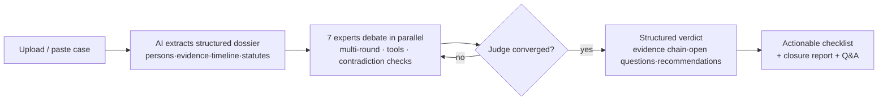
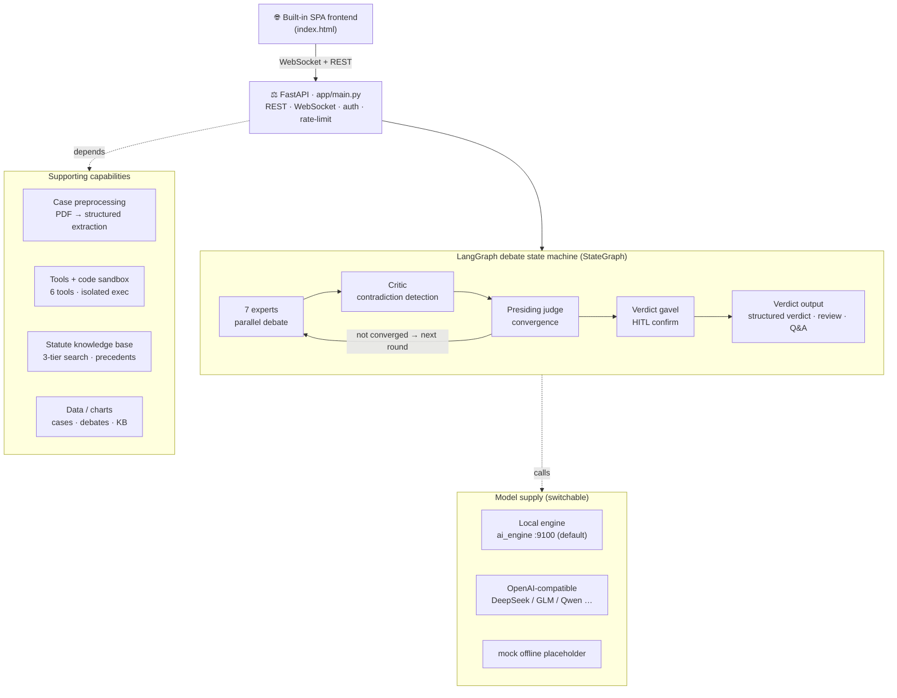

<p align="center">
  
</p>

<h1 align="center">⚖️ VerdictAI</h1>

<p align="center">
  <b>7 AI experts cross-examine a real case file, cite real statutes &amp; precedents,
  and hand you a structured verdict — no API key needed.</b>
</p>

<p align="center">
  <a href="https://github.com/x33834/VerdictAI"></a>
  <a href="https://github.com/x33834/VerdictAI/releases/latest"></a>
  <a href="https://github.com/x33834/VerdictAI/actions"></a>
  <a href="https://img.shields.io/badge/Python-3.10%2B-3776AB?style=for-the-badge&logo=python&logoColor=white"></a>
  <a href="https://img.shields.io/badge/License-MIT-yellow?style=for-the-badge"></a>
</p>

<p align="center">
  <a href="https://x33834.github.io/VerdictAI/"></a>
  <a href="https://github.com/x33834/VerdictAI/releases/latest/download/VerdictAI.zip"></a>
  <a href="https://github.com/Morningstar202604/VerdictAI"></a>
  <a href="https://gitcode.com/badhope/VerdictAI"></a>
  <a href="https://gitee.com/badhope/VerdictAI"></a>
</p>

<p align="center"><b>Official sites</b> (GitHub Pages, both accounts, identical):
  <a href="https://x33834.github.io/VerdictAI/">x33834.github.io/VerdictAI</a> ·
  <a href="https://morningstar202604.github.io/VerdictAI/">morningstar202604.github.io/VerdictAI</a>
</p>

<p align="center">
  <strong>English</strong> · <a href="README.zh-CN.md">中文</a> · <a href="README.ja-JP.md">日本語</a>
</p>

---

## What makes it worth 5 minutes of your time

Most legal-AI demos give you a paragraph. VerdictAI runs a **real deliberation**:
you drop in a case PDF, and a built-in *local* reasoning engine reads it, extracts the
people / evidence / timeline / applicable statutes, and then **7 specialized experts
argue against each other over multiple rounds** — a critic flags contradictions,
the judge converges on a verdict, and you get an evidence chain plus an actionable
checklist. Every step streams live to your browser.

> No cloud API, no sign-up, no placeholder text: the bundled local engine (`ai_engine`,
> port 9100) produces real analysis of your actual case file out of the box.

| | Traditional AI chat | **VerdictAI** |
|---|---|---|
| Stance-taking | One model, one opinion | **7 experts debate &amp; challenge each other** |
| Output | One-shot text | **Multi-round deliberation + contradiction detection** |
| Trust | Black box | **Full live event stream** — every token, tool call, agent status |
| Citations | May hallucinate | **Real statutes &amp; precedents** retrieved (never invented) |
| Documents | Unstructured upload | **AI document understanding** — persons / evidence / timeline / statutes |
| Deliverable | "AI says so" | **Structured verdict** — evidence chain, open questions, next steps |

## Who it's for

- **Legal practitioners** — a second opinion on evidence chains and applicable statutes before you commit to an argument.
- **Law students &amp; researchers** — watch how cross-examination and burden-of-proof reasoning unfold, step by step.
- **Curious engineers** — a complete agent-engineering kit: parallel agents, tool use, memory tiers, HITL — all in ~30s from zero.

## See it in action

<a href="docs/screenshots/landing.png"></a>
<a href="docs/screenshots/trial-debate.png"></a>

<a href="docs/screenshots/verdict-workflow.png"></a>
<a href="docs/screenshots/dark-mode.png"></a>

## Core capabilities

### 🧑‍⚖️ Seven experts, one case
Run in parallel every round, each with a distinct stance:

| Expert | Focus |
|---|---|
| 🔍 Crime Scene Analyst | Spatial logic, entry/exit, trace distribution |
| 🔬 Forensic Specialist | Cause of death, TOD window, injuries |
| 🧪 Evidence Analyst | DNA, fingerprints, custody chain, surveillance |
| 🧠 Behavioral Psych Expert | Statement credibility, motive, profiling |
| ⚖️ Evidence Law Expert | Admissibility, exclusion, proof standard |
| 👨‍⚖️ Prosecutor Agent | Charging chain, gaps, rebuttals |
| 🛡️ Defense Agent | Reasonable doubt, alternative explanations |

### 🔧 Experts that actually do things
They don't just talk — they call tools, and the results render into the transcript:
`read_evidence` · `timeline_check` · `list_contradictions` · `search_case_law` (three-tier)
· `web_search` (toggleable) · `run_code` (sandboxed Python; matplotlib charts land inline).

### 📄 Real document understanding
PyMuPDF reads up to 50 pages / 60K chars, extracts persons / evidence / timeline /
statutes from plain prose, and normalizes Chinese time expressions into a standard TOD
window for cross-validation. Every extraction carries an editable *"AI auto-extracted"* badge.

### ⚖️ Statute &amp; precedent knowledge base
Built-in stable provisions (Criminal Procedure Law, Criminal Law, Civil Code) plus
appeal-reasoning digests. Three-tier search **only cites what actually matches** — if
nothing matches, the agents say so instead of inventing citations.

### 💬 Multi-round debate engine
Configurable rounds &amp; memory window; old rounds compress into a rolling digest, a
critic feeds contradictions back every round, and the judge converges on consensus
(or the round cap).

### 🖥️ Live trial experience
Token-by-token streaming with speaking indicators, round stepper &amp; progress bar,
**human intervention** (interject mid-trial; every expert responds next round),
post-verdict Q&amp;A, dark mode, and EN / 中文 / 日本語 UI.

### ⚖️ Dual verdict mode
AI judge auto-converges, or a **human judge (HITL)** pauses to review. After verdict:
Q&amp;A, an executable **next-steps checklist** with progress, copy / Markdown export /
print-to-PDF, and a 🔨 closure card + full closure report.

### 🛠️ Agent engineering
Memory window, context limit, concurrency cap, call timeout, per-agent model overrides,
strategy presets, config import/export.

### 🚀 Deployment-ready
`python tools/start_all.py` — one-command start/stop, windowless daemons, auto-restart;
`ACCESS_PASSWORD` intranet gate with HMAC sessions; optional one-shot Docker sandbox for
`run_code`; `tools/backup.py` for data; runs fully offline.

## Get started — try it in ~30 seconds

```bash
# Option A · one-click release bundle
#   Windows / macOS / Linux — just download & unzip, then:
cd VerdictAI/backend
python -m venv .venv && source .venv/bin/activate   # Windows: .venv\Scripts\activate
pip install -r requirements.txt
python tools/start_all.py                           # one command: backend + local engine

# Option B · from source
git clone https://gitcode.com/badhope/VerdictAI.git
# or mirror: git clone https://github.com/x33834/VerdictAI.git  # also: github.com/Morningstar202604/VerdictAI · gitcode.com/badhope/VerdictAI · gitee.com/badhope/VerdictAI
cd VerdictAI/backend && pip install -r requirements.txt && python tools/start_all.py

# Option C · Docker
docker compose up -d --build
```

Open **http://localhost:8787** → drop in a PDF (or paste a description) → watch it parse
into a structured dossier → click **Open Trial** → watch 7 experts argue live.

> 📦 Ready-made bundle: grab the latest **VerdictAI.zip** from the
> [Release page](https://github.com/x33834/VerdictAI/releases/latest) — no git needed.

## How a trial runs



## Model providers

Out of the box it connects to the **bundled local reasoning engine** (`backend/ai_engine`,
port 9100) — real deterministic analysis, no API key. Works with any OpenAI-compatible API
(DeepSeek, GLM, Qwen, Ollama …) via `LLM_BASE_URL` + `LLM_API_KEY` in `backend/.env`.

```env
LLM_PROVIDER=openai_compatible
LLM_BASE_URL=http://127.0.0.1:9100/v1
LLM_MODEL=verdict-local
MAX_ROUNDS=3
```

## Architecture



**Why it's built this way** — LangGraph StateGraph (deterministic state machine, not ad-hoc
loops) · `asyncio.gather` + concurrency cap (parallel, rate-limit friendly) · tool fault
tolerance (one bad call never stalls a trial) · tiered memory (recent full, old compressed)
· citation discipline (statutes from retrieval, never imagination).

## Documentation

| Document | Description |
|----------|-------------|
| [Official website](https://x33834.github.io/VerdictAI/) | Features, screenshots &amp; download |
| [Architecture](docs/ARCHITECTURE.md) | System design, state machine, event types |
| [API Reference](docs/API.md) | REST endpoints &amp; WebSocket protocol |
| [Deployment](docs/DEPLOYMENT.md) | Docker, systemd, Nginx, performance tuning |
| [Contributing](CONTRIBUTING.md) | Dev setup &amp; guidelines |

## Honest words

This system is **research &amp; demonstration software**. AI-generated conclusions are
decision support, not legal advice — final responsibility always rests with human judges
and legal professionals. Where the knowledge base has no matching statute, the agents will
say exactly that rather than guess.

## License

[MIT License](LICENSE) — use it for anything.