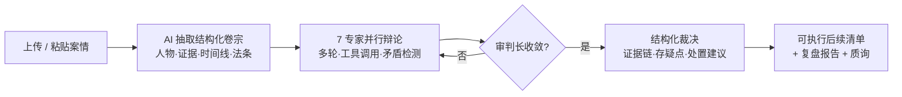
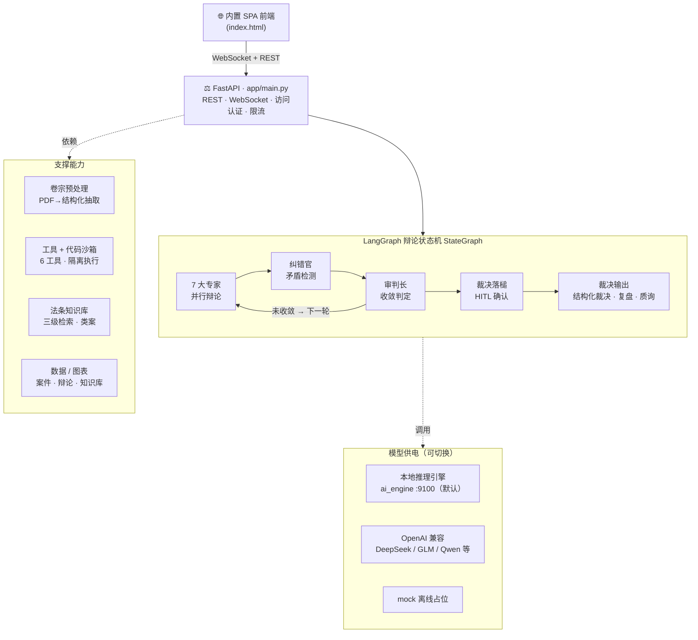

<p align="center">
  
</p>

<h1 align="center">⚖️ VerdictAI</h1>

<p align="center">
  <b>7 个 AI 专家交叉质证真实卷宗，引用真实法条与类案，直接给你一份带证据链的结构化裁决——无需任何 API Key。</b>
</p>

<p align="center">
  <a href="https://github.com/x33834/VerdictAI"></a>
  <a href="https://github.com/x33834/VerdictAI/releases/latest"></a>
  <a href="https://github.com/x33834/VerdictAI/actions"></a>
  <a href="https://img.shields.io/badge/Python-3.10%2B-3776AB?style=for-the-badge&logo=python&logoColor=white"></a>
  <a href="https://img.shields.io/badge/License-MIT-yellow?style=for-the-badge"></a>
</p>

<p align="center">
  <a href="https://x33834.github.io/VerdictAI/"></a>
  <a href="https://github.com/x33834/VerdictAI/releases/latest/download/VerdictAI.zip"></a>
  <a href="https://github.com/Morningstar202604/VerdictAI"></a>
  <a href="https://gitcode.com/badhope/VerdictAI"></a>
  <a href="https://gitee.com/badhope/VerdictAI"></a>
</p>

<p align="center"><b>官方网站</b>（GitHub Pages 双号部署，内容一致）：
  <a href="https://x33834.github.io/VerdictAI/">x33834.github.io/VerdictAI</a> ·
  <a href="https://morningstar202604.github.io/VerdictAI/">morningstar202604.github.io/VerdictAI</a>
</p>

<p align="center">
  <strong>中文</strong> · <a href="README.md">English</a> · <a href="README.ja-JP.md">日本語</a>
</p>

---

## 值得你花 5 分钟的理由

市面上的法律 AI 演示大多只给你一段话。VerdictAI 运行的是**一场真实的合议**：
拖入一份案件 PDF，内置的**本地推理引擎**读卷、抽取人物 / 证据 / 时间线 / 适用法条，
然后 **7 个专职专家多轮互相质证**——纠错官揪矛盾、审判长收敛裁决，
最终给你证据链 + 可执行的后续清单。每一步都实时流式推送到浏览器。

> 无云 API、无注册、无占位文本：内置本地引擎（`ai_engine`，端口 9100）开箱即用，
> 跑的是你这份真实卷宗的真实分析。

| | 传统 AI 问答 | **VerdictAI** |
|---|---|---|
| 立场 | 单模型、一个观点 | **7 个专家互相质证、彼此挑战** |
| 产出 | 一次性文本 | **多轮合议 + 矛盾检测** |
| 信任 | 黑箱 | **全事件流直播**——每个 token、工具调用、智能体状态 |
| 引用 | 可能编造 | **真实法条与类案**检索（绝不虚构） |
| 文档 | 非结构化上传 | **AI 卷宗理解**——人物 / 证据 / 时间线 / 法条自动抽取 |
| 交付 | “AI 说算” | **结构化裁决**——证据链、存疑点、下一步行动项 |

## 适合谁

- **法律从业者** — 在正式定论点之前，先听听 AI 对证据链和适用法条的「第二意见」。
- **法学生与研究者** — 看交叉询问和证明责任推理如何一步步展开，边看边学。
- **好奇的工程师** — 一套完整的智能体工程套件：并行智能体、工具调用、分层记忆、人在回路（HITL），约 30 秒从零跑起来。

## 界面一览

<a href="docs/screenshots/landing.png"></a>
<a href="docs/screenshots/trial-debate.png"></a>

<a href="docs/screenshots/verdict-workflow.png"></a>
<a href="docs/screenshots/dark-mode.png"></a>

## 核心能力

### 🧑‍⚖️ 七大专家，一案同审
每轮并行出场，立场各异：

| 专家 | 关注点 |
|---|---|
| 🔍 现场勘查员 | 空间逻辑、进出路线、痕迹分布 |
| 🔬 法医专家 | 死因、死亡时间窗、伤情 |
| 🧪 物证分析师 | DNA、指纹、保管链、监控 |
| 🧠 行为心理专家 | 供述可信度、动机、画像 |
| ⚖️ 证据法专家 | 采信、排除、证明标准 |
| 👨‍⚖️ 公诉智能体 | 指控链、漏洞、反驳 |
| 🛡️ 辩护智能体 | 合理怀疑、替代解释 |

### 🔧 会干活的专家
他们不只会说话，还会调用工具（结果直接渲染进笔录）：
`read_evidence` · `timeline_check` · `list_contradictions` · `search_case_law`（三级检索）
· `web_search`（可开关）· `run_code`（沙箱 Python，matplotlib 图表直入笔录）。

### 📄 真实卷宗理解
PyMuPDF 读取最长 50 页 / 6 万字符，从纯文本叙事中抽取人物 / 证据 / 时间线 / 法条，
并把中文时间表达归一化为标准死亡时间窗用于交叉校验。每次抽取都带可编辑的“AI 自动抽取”标记。

### ⚖️ 法条与类案知识库
内置《刑诉法》《刑法》《民法典》稳定条文 + 类案裁判摘要。三级检索**只在真正匹配时才引用**——检索不到就如实说明，绝不编造。

### 💬 多轮辩论引擎
轮次与记忆窗口可配；久远轮次压缩为滚动摘要而非丢弃；纠错官每轮回灌矛盾；
审判长收敛至共识或轮次上限。

### 🖥️ 实时庭审体验
逐字流式输出 + 发言指示、轮次步进条、专家状态；**人工插话**（庭中打断，下轮全员响应）；
裁决后质询；深色模式；中 / 英 / 日三语界面。

### ⚖️ 双裁决模式
AI 审判长自动收敛，或**人工审判长（HITL）**暂停复核；裁决后支持质询、可勾选**后续清单**
（一键复制 / Markdown 导出 / 打印 PDF）、🔨 结案卡与完整复盘报告。

### 🛠️ 智能体工程
记忆窗口、上下文上限、并发上限、调用超时、按智能体模型覆盖、策略预设、配置导入导出。

### 🚀 部署就绪
`python tools/start_all.py` 一键启停（无窗口守护 + 自动重启）；`ACCESS_PASSWORD` 内网访问口令门（HMAC 会话）；
`run_code` 可选一次性 Docker 沙箱；`tools/backup.py` 数据备份；可完全离线运行。

## 快速开始——约 30 秒跑起来

```bash
# 方式 A · 一键发行包
#   Windows / macOS / Linux — 下载解压即可，然后：
cd VerdictAI/backend
python -m venv .venv && source .venv/bin/activate   # Windows: .venv\Scripts\activate
pip install -r requirements.txt
python tools/start_all.py                           # 一条命令：后端 + 本地引擎

# 方式 B · 源码
git clone https://gitcode.com/badhope/VerdictAI.git
# 或镜像：git clone https://github.com/x33834/VerdictAI.git（另有：github.com/Morningstar202604/VerdictAI · gitcode.com/badhope/VerdictAI · gitee.com/badhope/VerdictAI）
cd VerdictAI/backend && pip install -r requirements.txt && python tools/start_all.py

# 方式 C · Docker
docker compose up -d --build
```

打开 **http://localhost:8787** → 拖入一份 PDF（或粘贴案情描述）→ 看它解析为结构化卷宗 →
点 **开庭审理** → 看 7 个专家实时辩论。

> 📦 现成包：最新 **VerdictAI.zip** 在 [Release 页](https://github.com/x33834/VerdictAI/releases/latest)，
> 无需安装 git。

## 一次庭审怎么跑



## 模型提供方

开箱即连**内置本地推理引擎**（`backend/ai_engine`，端口 9100）——真实确定性分析，无需 API Key。
也兼容任意 OpenAI 兼容 API（DeepSeek、GLM、Qwen、Ollama 等）：在 `backend/.env` 配置 `LLM_BASE_URL` + `LLM_API_KEY`。

```env
LLM_PROVIDER=openai_compatible
LLM_BASE_URL=http://127.0.0.1:9100/v1
LLM_MODEL=verdict-local
MAX_ROUNDS=3
```

## 架构



**为什么这样设计** — LangGraph StateGraph（确定性状态机，而非临时循环）·
`asyncio.gather` + 并发上限（并行且限流友好）· 工具容错（一次坏调用绝不拖垮整场辩论）·
分层记忆（近期全量、久远压缩）· 引用纪律（法条来自检索，绝不来自模型想象）。

## 文档

| 文档 | 说明 |
|------|------|
| [官网](https://x33834.github.io/VerdictAI/) | 功能展示、截图与下载 |
| [架构](docs/ARCHITECTURE.md) | 系统设计、状态机、事件类型 |
| [API 参考](docs/API.md) | REST 端点与 WebSocket 协议 |
| [部署](docs/DEPLOYMENT.md) | Docker、systemd、Nginx、性能调优 |
| [贡献指南](CONTRIBUTING.md) | 开发环境与规范 |

## 坦言

本系统是**研究与演示软件**。AI 生成的结论属于决策辅助、不构成法律意见——最终责任始终在人类法官与法律专业人士。
知识库没有匹配法条时，智能体会直言「没有匹配」，而不是猜测。

## 许可证

[MIT License](LICENSE) — 可自由用于任何场景。